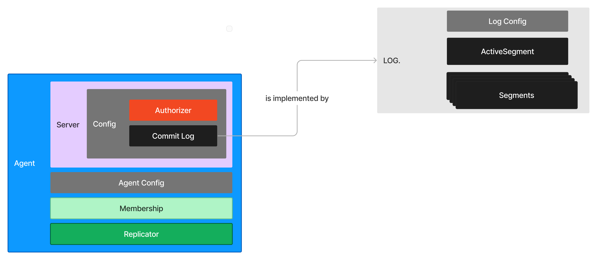

# Proglog
Commit logs - append-only data structure, sequenced by time.

### http Handlers notes:
Each handler consists of three steps:
1. Unmarshal the request's JSON body into a struct.
2. Complete that endpoint's logic with the request, obtain a result.
3. Marshal and write the result to the response.
If a handler becomes much more complicated than this, then move req & resp handling to middleware, business logic further down the stack.

### protobuf & grpc notes:
Protobuf pros:
- type safety
- prevents schema violations
- fast serialization
- backward compatibility (new code can read old data structures)

The magic internal packages are used to restrict access to certain packages within a project. Packages inside an internal directory can only be imported by code within the parent directory or its subdirectories. This helps in encapsulating code and preventing it from being used outside its intended scope.

Types of gRPC Streaming RPCs:
Unary: Single request and single response.
Server streaming: Single request and multiple responses (streamed from server to client).
Client streaming: Multiple requests (streamed from client to server) and single response.
Bidirectional streaming: Both client and server send a sequence of messages using a read-write stream.
note: Rcv() is a blocking call, waits until a msg is received or the stream is closed.

### Security notes:
Fav quote about securing an application: "Whenever I'm building a service, I think about what it'd be like if the data I'm trying to protect was publicly posted all over planet. Picturing this gives me the motivation to make sure that sort of thing doesn't happen to me, ..."

Secrutiy of distrtibuted services in three steps:
1. Encrypt the transmitted/in-flight data against MITM (man in the middle)
    - TLS - successor to SSL
    - Typically web services user one-way auth and only auth the server through the handshake that's initiated when the client and server connect. It's up to the app to auth the user
    - Certs for internal distributed systems don't need to come from a third party, one can operate a CA (cert authority) themself
2. Authentication to identify clients (who is who)
    - There's also a two-way auth or TLS mutual auth, whcih is used in machine-to-machine communication, or distributed systems. Both client and server use a cert to auth itself
3. Authorization to assign the right permissions to the ID-ed clients.
    - when you have a shared resource with varying levels of ownership (read/write permissions)
    - ACL - access control list in quite common. It's a essentially a table with rules on what someone can or can't do.
    - in ACL permissions are attached directly to resources, in RBAC - to roles

### Observability notes:
It gives us the chance to look into and fix unexpected problems.
- the measure of how well we understand our system's internals

Three types of telemetry data:
#### Metrics
- numeric data over time that help us define SLIs, SLOs, and SLAs
Typically, as your system / business grows, you can reduce the resolution of the mentrics by making them less granular, agregating them, deleting irrelevant data after processing, that way you make it easier on the storage.
##### Counters
- Track the num of times something happened. Often used to get rate aka how many times per time interval something happened. Requests handled per second, error rate.
##### Historgrams
- Shows data distribution. Mainly used for measuring percentiles of request duration and sizes.
##### Gauges
- Track the curruent value of something. Useful for saturation-type metrics: host's disk storage, num of load balancers compared to provider's limit.

What to measure (Google) ?
##### Latency
- the time it takes your service to process requests. Can be a signal to scale the system.
##### Traffic  
- the amount of demand on the service. This could be requests procezssed per second, num of concurrent users (for streaming), etc.
##### Errors
- request failure rate, esp. internal server errors.
##### Saturation 
- a measure of service's capacity.
at the current ingress rate, how soon will you run out of hard drive space? how much memory the service uses compared to the available memory?

#### Structured logs
- a set of name value ordered pairs encoded in consistent schema and format. Enable to separate log acapture from transporting, persisting, and querying.
It can be a good practice to connect the logs to an event streamning platofrm like Kafka.

#### Traces
- capture request lifecycles and let you track requests as they flow through your system. There are services that can provide a visual representation of where the request spent its time.

### Service discovery notes:
For clients to reach a server, once we have more than one instance, we put a load balancer in front of it. The load balancers knows the address of each node, and its status. It redirects the client to the correct intance. It's fine to use them but it has its own trade offs like being a SPOF, introducing new cost, maintenance, and possibly latency. 

For server-to-server communication, or for the internal services to comminicate, we don't really need a trust boundary since the communication is internal. We still, however, need to discover other intances and services in the system to talk to. Service discovery keeps track of the server instances, their IP, ports, their health, and deregesters them if they go offline/updates their status.

Using service-discovery service transfers the burden from you to the users, which is honestly not a big deal if that's done for an in-org service.
Now, however, it's possible to embed the service discovery into your own service.
This is useful, so that once a new node goes online, it can replicate the data from the other nodes, whcih makes the service more resilient.

<b>Pull-based replication</b> - periodically poll the data source to check if there's new data to consume (good in log and msg systems when consumers and work loads can differ e.g. one runs continuously, the other - every 24h).
<b>Push-based replication</b> - the data source pushes the data to its replicas.

### Load balancing notes:
Strategies:
- <b>Server proxying (most common)</b>: the client sends its requessts to a load balancer that either knows the servers by querying a service register or by encapsulating a 
    service registry. It proxies the requests to the back-end services.
- <b>External load balancing (operational burden(?) + costs)</b>:
    the client calls an external load-balancing service that knows the servers and tells the client what address to query.
- <b>Client-side balancing (when you trust the clients, e.g. for internal use)</b>:
    the client takes on the responsibility of querying the service registry to learn about servers and picks a server to send the call to.
gRPC balances the calls using a DNS resolver(default) and round-robin algorithm.
Round-robin works well when all servers are performing the same type of work equally. Doesn't work well for the leader-followers architecture. Also doesn't work well with globally distruibuted service, as we'd want to connect the clients to the instances located closer to them. Lastly, doesn't work well in case you want to direct the request to the server with, say, the lowest number of queued requests (trying to optimize for latency).

If we wanted to use a diff alforithm, we could always write our own resolver (discovers servers) and picker(manages directing produce calls to the leader and balancing consumes across the followers).

Pickers handle the RPC balancing logic. They pick a server from the servers discovered by the Resolver to handle each RPC. Pickers can route client calls based on information about the call, client, and server. 

### Kubernetes notes:
Kubernetes is an open source otchestration system for automating deployment, scalingm and operating services running in containers.
It has a REST API. You can provide it with an 'end-goal' state and it'll figure out how to get to that state from the current one.
<b>Pods</b> - smallest deployable unit in K8s. All containers (processes) running in a pod share the same network namespace, IP address, and the same 
interprocess communication (IPC) namesapce, same volumes. Pods are logical hosts.
<b>Nodes</b> - physical hosts (may run multiple pods).
Kubernetes is extendable (can create custom resources and controllers).
<b>Controllers</b> - control loops that watch the state of the resources and make changes where needed. Kubernetes is made up of many controllers.
kubectl is a common way of interacting with Kybernetes.
Kind (K8s in Docker) - allows to run local k8s clusters using Docker containers as nodes.
// kind create cluster
// kubectl cluster-info
// kubectl cluster-info dump
// kind load docker-image github.com/innazh/proglog:0.0.1

### Helm notes:
Helm is a package manager for K8s that enables you to distribute and install services in K8s. 
Packages == <i>charts</i>. Think "npm for kubernetes". It defines all resources required to run a service in a k8s cluster.
Just like npm, Helm makes it easier for others to run your application.
A <i>release</i> - an instance of running a chart. It's like a 'process'.
Repositories are used to share charts. You can add repos to install pacakges.
// helm repo add x https://...
// helm install x x

### The Raft Consensus Algorithm
https://raft.github.io/
Raft is typically used for leader-election capability as well as replication. 
Consensus is a fundamental problem in fault-tolerant distributed systems, suince a number of different services need to agree on values/state. Consensus algorithm ensures that all servers agree on the order of log entries/operations.
The recommended sizes for a cluster are 3 (to handle 1 failure) and 5 (to handle 2 failures)

## The order of building / operations in this project:
### Chapter 1:
1. We defined the model of a Log and access methods. 
2. We defined an Http server, a method to create it, routes, and handler's names and signatures.
3. Request and response structs (since we're receiving requests and sending responses, that have to be marshalled/unmarshalled.)
4. Implement the handlers
5. main.go logic to run the server
### Chapter 2: Protocol Buffers
1. Define protos & make sure it compiles
learning opportunity: can write a protobuf extensions/plugins
### Chapter 3: Write a Log Package
1. Create an store for our log files (a wrapper around a 'file' in our case)
2. Code up the read and write methods to persist our records
3. Test file
4. Write out the index struct and logic, test file
5. Segment logic (so that we can split our log into segmentes when one gets too big), test file
6. Code the Log + test
### Chapter 4: Add gRPC service
1. Add grpc Log service, declare methods, response and request objects
2. Compile the code and see it generate log_grpc.pb.go
3. Implement a grpc server that will implement the Log Service and define its methods
4. Error handling
5. Swap out the concrete Log structure / object our server depends on to an interface
6. Create a gRPC server and register it (NewGRPCServer)
7. Tests!
### Chapter 5: Security
1. Create a cert issuer authority using CloudFlare's open source lib
2. Define the configs and write out the makefile cmds to generate certs
3. Add a /config dir to take care of retrieving the cert files and parsing them
4. Add grpc opts to our server so it can handle a creds opt to handle tls conns
5. Add ACL by adding policy and model, use casbin pkg to enforce it
6. Add an interceptor / middleware to our grpc server to extract cert's cn for the server to check
7. In the test cases / when instantiating the server, we now define the Authorizer interface and voila!
### Chapter 6: Observability
1. Add libs for logging , metrics and tracing (OpenCensus, zap)
2. Set it up at the start of the server
3. Wrap the created and configured log in the middleware
4. Before instantiating the server, setup the files/output for tracing and metrics via LogExporter
5. Close the files as a part of graceful shutdown
### Chapter 7: Service discovery
1. We're using a sef HashiCorp's library for tracking the state of our cluster and passing the info from one node to another
2. Defined handler interface which can keep track of the members that leave or join
3. Defined the functionality and config for the nodes inside the cluster: we're listening on join, leave, and fail events for the nodes
4. Test file that implements the handler which just keeps track of the members (it doesn't have to be complicated at this point)
5. Build replication (implements the handler)
6. Build an Agent that orchestrates and sets up the entire service instance, visual representation of the service is in the img below
7. Test that sets up a cluster with 3 nodes, and verifies that the other servers will replicate the record we write to one of them
Current replication implementation's problem: the servers replicate each other in a cycle, making it an infinite replication.

### Chapter 8: Coordinating services with Consensus
1. Get hashicorp's raft
2. Create a DistributedLog that consists of Raft, Log, LogStore, and Config
3. Extend our Config struct to include a RaftConf struct
4. Write methods to init Raft and boostrap the cluster
5. Write DistributedLog's API, and implement all interfaces required by Raft
6. Integrate our discovery layer with Raft (Impl discovery.Handler's interface for DistributedLog)
7. Setup Multiplex run multiple services on one port
### Chapter 9:  Discover services and Load Balance
1. Add a GetServers() endpoint that clients can call get servers' information (this is basically our server-attached service registry)
2. Code loadbalance.Resolver (implements grpc's resolver & builder interfaces), register it, and write a test
3. Code loadbalance.Picker and impl the tests
4. Upd the client in our agent test to use our resolver, add the wait for replication there
### Chapter 10: Deploy with Kubernetes
1. Instal k8s & kind, get a cluster running
2. Write a CLI interface that can run our program using cobra, viper
3. Dockerfile, makefile cmd to build it
4. Load the container into locally running Kind cluster
5. Create a helm package for easier deploy